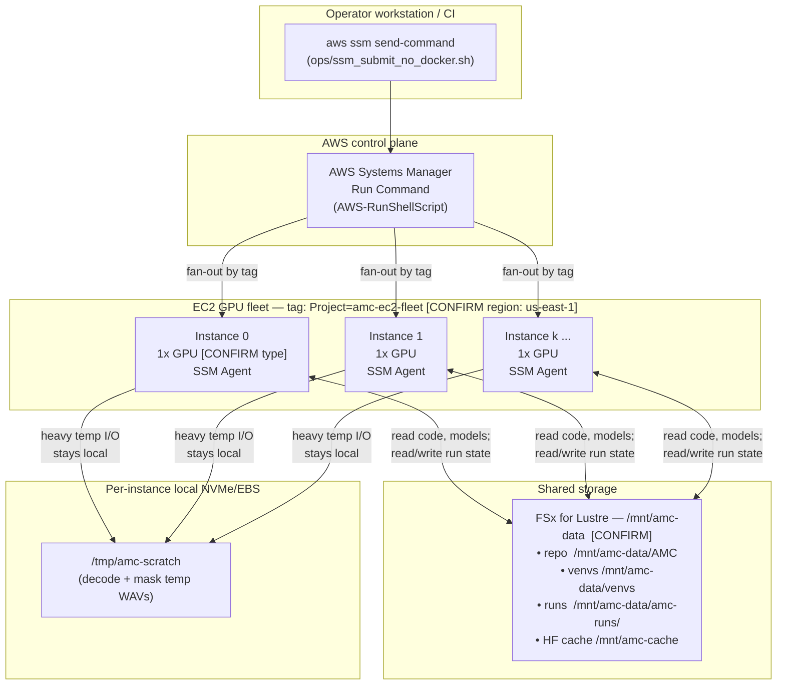
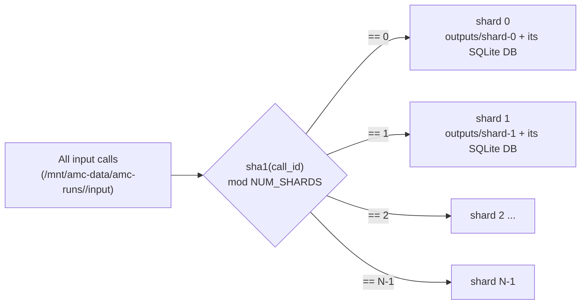
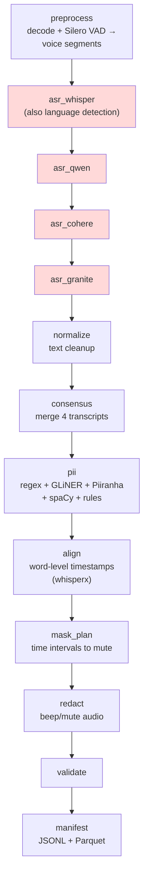
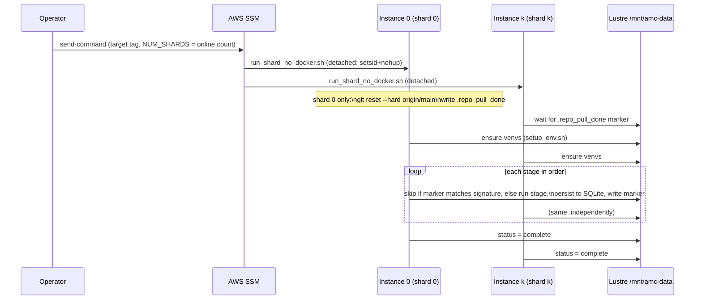
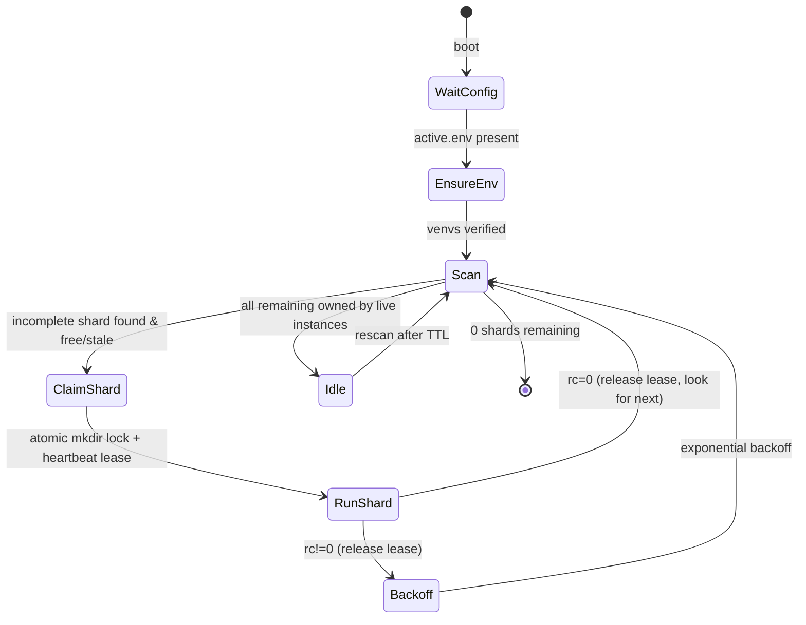
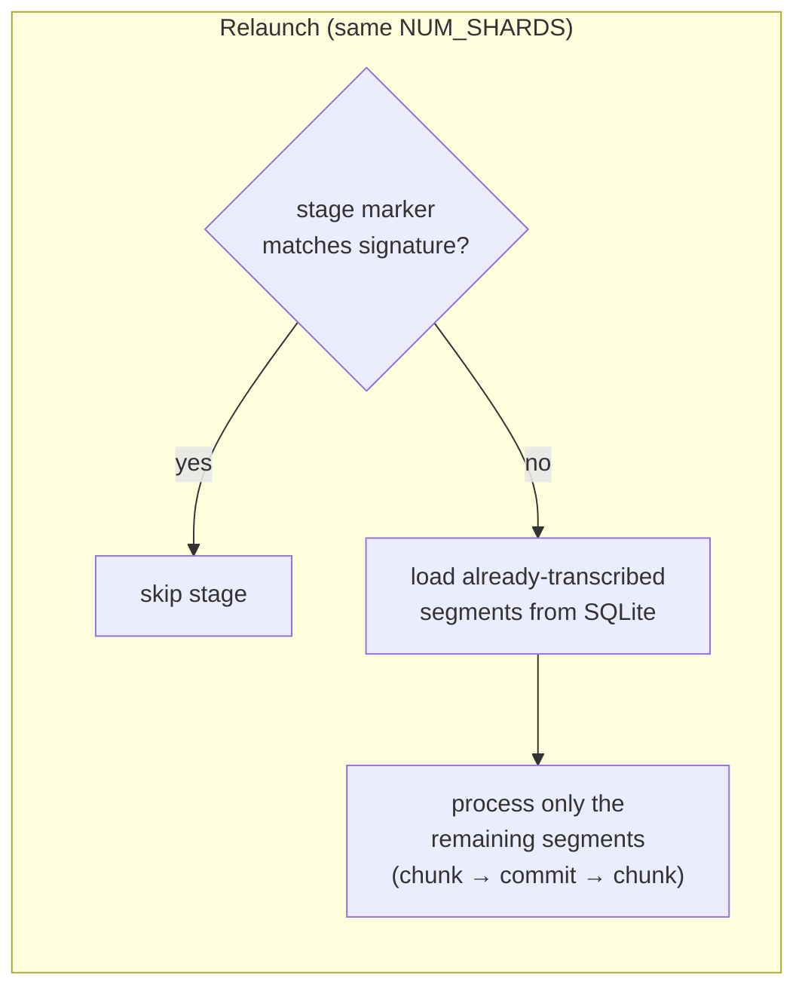
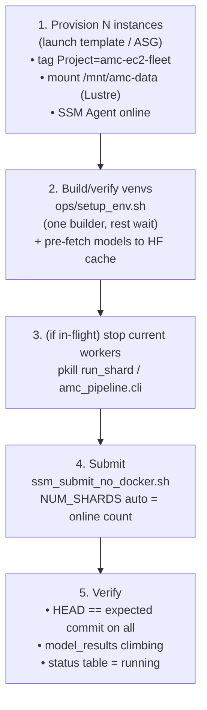

# AMC Audio PII Masking Pipeline — Architecture & Scaling

> Purpose: a single reference for discussing the system with the AWS team — what runs
> where, how work is partitioned across machines, how we scale the fleet, and how the run
> survives interruptions. Diagrams are Mermaid (render in GitHub / VS Code / mermaid.live).
>
> Items marked **[CONFIRM]** are deployment facts to fill in with your AWS account details.

---

## 1. What the pipeline does

It ingests raw call-center audio, transcribes it with an **ensemble of 4 ASR models**, builds
a **consensus transcript**, detects **PII** (names, phone numbers, etc.), and produces
**redacted audio** plus structured manifests. It runs as an embarrassingly-parallel batch job
over a fleet of GPU EC2 instances coordinated through AWS Systems Manager (SSM).

Current production run (`2026-full`): ~32,400 calls → ~965,000 voice segments, 4 shards.

---

## 2. AWS infrastructure (physical view)



Key points for AWS:
- **Compute:** homogeneous GPU instances, **1 GPU per instance** (`CUDA_VISIBLE_DEVICES=0`).
  GPU memory footprint per ASR model is small (~3.5–4 GiB observed for Whisper). **[CONFIRM
  instance type, GPU model, On-Demand vs Spot.]**
- **Fleet membership = an EC2 tag** `Project=amc-ec2-fleet`. The submitter discovers workers
  with `ssm describe-instance-information` filtered by that tag and `PingStatus==Online`.
  **Adding capacity = launching more instances with that tag** (and the shared mount + venvs).
- **Shared filesystem:** one cluster-wide POSIX mount at `/mnt/amc-data` (FSx for Lustre).
  It holds the code checkout, the prebuilt Python environments, the input audio, and all run
  state. This is the backbone that makes instances stateless and interchangeable.
  - ⚠️ `/mnt/amc-runs` is **local per instance** and must NOT be used for run state — only the
    Lustre mount `/mnt/amc-data` is shared. The submit script guards against this.
- **No containers/Docker** in this path — stages run in prebuilt venvs on the shared mount.
- **Networking:** instances need outbound to AWS APIs (SSM, optionally S3) and, on first
  provisioning, to Hugging Face / PyPI / PyTorch index to build venvs + download models.

---

## 3. Storage layout (logical view)

```
/mnt/amc-data/                         (FSx for Lustre, shared)
├── AMC/                               git checkout (origin/main); auto-pulled by shard 0
│   ├── amc_pipeline/                  pipeline package
│   └── ops/                           orchestration scripts
├── venvs/                             built ONCE, reused by all instances
│   ├── main/   (whisper, qwen, granite, normalize, pii, mask, validate, manifest)
│   ├── align/  (whisperx — align stage only)
│   └── cohere/ (transformers>=5.4 — cohere ASR only)
└── amc-runs/<run>/                    one run root
    ├── input/                         sharded input audio (<year>/<call>/audio.*)
    ├── status/shard-<i>.json          live per-shard heartbeat/status
    ├── shards/shard-<i>.lock/         lease pool (auto-resume claims)
    ├── logs/shard-<i>/<stage>.log     per-stage logs
    └── outputs/shard-<i>/             per-shard outputs (DISJOINT across shards)
        ├── .pii_pipeline/state/pipeline.sqlite3   per-shard state DB (WAL)
        ├── .pii_pipeline/stage_markers/<stage>.done
        └── <year>/<call>/...          redacted audio + segment clips + manifests
```

Each shard owns an **independent SQLite state DB** and an **independent output subtree**. Calls
never collide across shards (see sharding), so the final merge is a plain union.

---

## 4. Sharding model — how work is split across machines

Work is partitioned by a **stable hash of the call id**, not by instance identity:

```
shard_index(call) = sha1(call_id) mod NUM_SHARDS
```

`NUM_SHARDS` is chosen **at submit time = the number of online tagged instances**. Each instance
processes exactly the calls whose hash maps to its shard index.



Properties:
- **Deterministic & disjoint:** every call belongs to exactly one shard → no duplication, no
  cross-shard coordination during processing, trivial merge at the end.
- **`NUM_SHARDS` is baked into the partition.** The per-shard input "signature" (used to skip
  finished stages) is computed over *that shard's* file set, so it depends on `NUM_SHARDS`.
- **Consequence for scaling:** changing `NUM_SHARDS` (e.g. 4 → 32) re-assigns every call to a
  different shard index and a different (empty) state DB, and invalidates stage signatures.
  See §8 for the implications when scaling a run that is already in progress.

---

## 5. The processing pipeline (13 stages)

Stages run **sequentially per shard**, each gated by a completion marker so finished stages are
skipped on restart. The ASR ensemble is the dominant cost.



| Stage | What it produces | venv | Device |
|-------|------------------|------|--------|
| `preprocess` | Voice segments (Silero VAD) per channel | main | **CPU VAD** (default) |
| `asr_whisper` | Whisper transcript + detected language | main | GPU |
| `asr_qwen` | Qwen transcript (supported langs only) | main | GPU |
| `asr_cohere` | Cohere transcript | cohere | GPU |
| `asr_granite` | Granite transcript | main | GPU |
| `normalize` | Normalized text | main | CPU |
| `consensus` | Single agreed transcript from the 4 | main | CPU |
| `pii` | PII spans (ensemble detectors) | main | GPU/CPU |
| `align` | Word-level timestamps | align (whisperx) | GPU |
| `mask_plan` | Time intervals to mask | main | CPU |
| `redact` | Redacted (beeped) audio | main | CPU + ffmpeg |
| `validate` | Integrity checks | main | CPU |
| `manifest` | JSONL + Parquet dataset | main | CPU |

Why the ASR stages are split per model: each writes its own `model_results` rows, so any model
can be re-run independently, and a slow/failing model never blocks the others.

---

## 6. Per-stage Python environments

Three venvs are built **once** on the shared mount and reused by every instance (no per-instance
multi-GB reinstall). They exist because the dependency sets are mutually incompatible:

| venv | Used by | Why isolated |
|------|---------|--------------|
| `main` | all stages except `align`, `asr_cohere` | `qwen-asr` hard-pins `transformers==4.57.6`; torch 2.5.1+cu121, numpy<2 |
| `align` | `align` only | whisperx 3.4.2 + pyannote; different transformers/hf pins |
| `cohere` | `asr_cohere` only | needs `transformers>=5.4.0` (incompatible with the qwen pin) |

`ops/setup_env.sh` builds them under an **NFS-safe single-builder lease** (one instance builds,
the rest wait on a ready marker), then every instance verifies torch+CUDA imports locally before
doing work. A signature over the requirement files gates rebuilds.

---

## 7. Orchestration — two modes

### 7a. Push mode (manual launch) — `ops/ssm_submit_no_docker.sh`



- One-shot. The worker is detached with `setsid + nohup` so it **outlives** the bounded SSM
  invocation (SSM RunShellScript SIGKILLs its process group on completion/timeout, which would
  otherwise kill multi-day runs).
- Instance → shard mapping is positional (sorted instance-id order).

### 7b. Auto-resume mode (self-healing) — `ops/resume_shard.sh` via systemd

For fleets that get recreated (nightly teardown, Spot) this decouples shards from instance IDs.
A systemd unit (installed via EC2 user-data `ops/userdata_bootstrap.sh`) runs a loop that
**claims an incomplete shard from a shared lease pool**, runs it, then claims the next:



- **Lease = atomic `mkdir` on the shared FS + a heartbeat timestamp.** If an owner goes silent
  (Spot reclaim, OOM, reboot), its lease goes stale and another instance **takes over that
  shard and resumes its state in place**.
- This is what makes the fleet elastic and crash-tolerant without a central scheduler.

---

## 8. Resumability & state (why a stop never loses work — at the same shard count)

Two independent layers:

1. **Per-stage markers** (`stage_markers/<stage>.done`, keyed by the shard's input signature):
   a finished stage is **skipped** on relaunch. So restarting only re-runs unfinished stages.
2. **Per-segment incremental persistence inside a stage:** every stage writes results to the
   shard's SQLite DB as it goes and skips rows already present. For ASR specifically, transcripts
   are committed in **call-grouped chunks** (default 256 segments, `AMC_ASR_PERSIST_CHUNK`), so a
   crash mid-model resumes from the last committed chunk — not from zero — and `model_results`
   climbs live. (This applies to all 4 ASR models.)



### ⚠️ Scaling a run already in progress: 4 → 32 does NOT resume

Because the partition and the stage signatures both depend on `NUM_SHARDS`:
- a relaunch at 32 shards re-assigns every call to a different shard index reading a different
  (mostly empty) DB, and markers no longer match → **work is effectively redone**.

**Therefore the choice is mutually exclusive:**

| Option | Resumes prior work? | Throughput | When to use |
|--------|--------------------|------------|-------------|
| Restart same `NUM_SHARDS`, same run root | ✅ yes | unchanged | can't add machines |
| Restart bigger `NUM_SHARDS`, same run root | ❌ no (misaligned) | — | never |
| Restart bigger `NUM_SHARDS`, **fresh run root** | ❌ starts at 0 | ~linear in machines | you added machines |

The trade is usually worth it: redone work is recovered by the higher throughput almost
immediately (e.g. at 8× machines, redoing a few hours of Whisper is recovered in well under an
hour, and the whole pass finishes far sooner).

---

## 9. How to scale the fleet — step by step



Concrete steps (push mode):
1. **Capacity:** launch the extra instances from the same launch template/AMI so they come up
   with the tag, the Lustre mount, and the SSM agent. Confirm they show `Online` in
   `ssm describe-instance-information`.
2. **Environments:** run `ops/setup_env.sh` (idempotent — fast no-op if venvs already built; new
   instances just verify imports). Pre-fetch ASR models into the HF cache so 32 instances don't
   stampede the model download.
3. **Stop** any in-flight workers if you're re-sharding (see §8).
4. **Submit** with the same `AMC_IN`; `NUM_SHARDS` auto-derives from the online count. Use a
   **fresh `RUN_ROOT`** if `NUM_SHARDS` changed.
5. **Verify** new code is live (`git rev-parse HEAD` on all) and `model_results` is climbing.

Scaling characteristics:
- **Throughput scales ~linearly** with instance count (no shared bottleneck during processing;
  state writes are local-per-shard on Lustre).
- **Best efficiency when `files >> NUM_SHARDS`** so every shard has comparable work. With
  hash partitioning, shard sizes are even within a few percent at this scale.
- **Watch on big fan-out:** (a) model-download stampede on first run → pre-warm HF cache;
  (b) venv build stampede → the single-builder lease handles it; (c) Lustre throughput/IOPS for
  N concurrent shards → size the FSx tier accordingly **[CONFIRM FSx throughput tier]**.

---

## 10. Output merge

After all shards finish, `ops/merge_shards.sh` unions the disjoint per-shard outputs into one
dataset:
- `rsync` redacted call audio + segment clips into `FINAL_OUT` (paths are disjoint by design).
- assemble a **Parquet dataset** — one part file per shard (`part-shard-<i>.parquet`) — readable
  as a single table by DuckDB / pandas / polars / pyarrow.
- concatenate `all_segments.jsonl` as a durable stream-readable fallback.

---

## 11. Capacity planning (current measured numbers)

| Quantity | Value |
|----------|-------|
| Calls (this run) | ~32,400 |
| Voice segments | ~965,000 (~30 / call) |
| Whisper rate / shard | ~1.3–1.6 segment/s/GPU |
| ASR models in consensus | 4 (whisper, qwen, cohere, granite) |
| GPU mem / ASR model | ~3.5–4 GiB |

Rough wall-clock for the Whisper pass (one of four ASR models):

| Machines | Fleet rate | Whisper pass (~965k seg) |
|----------|-----------|--------------------------|
| 4 | ~5.4 seg/s | ~50 h |
| 8 | ~11 seg/s | ~25 h |
| 16 | ~22 seg/s | ~12 h |
| 32 | ~43 seg/s | ~6 h |

(qwen / cohere / granite run after Whisper on the language-supported subset; total ASR ≈ a few ×
the Whisper pass. Levers to cut total time: lossless full-call batched Whisper
`AMC_WHISPER_FULLFILE_BATCH=1`; fewer consensus models; faster GPUs.)

---

## 12. Failure handling summary

| Failure | Behavior |
|---------|----------|
| Single segment errors in a model | written as `failed`; retried on next relaunch (resume keeps only `transcribed`) |
| A whole model errors on a chunk | that chunk persisted as `failed`, other chunks continue; model retried next run |
| Instance dies mid-stage (Spot/OOM/reboot) | push mode: relaunch resumes from last committed chunk + last stage marker. auto-resume mode: another instance steals the stale lease and resumes |
| Existing box reboots / Spot stop→start | `amc-shard.service` is `enabled`, so it auto-starts on boot, reads the shared config, re-claims a shard, and resumes — **no intervention** |
| Surviving box is idle (standby) when one is lost | standby steals the stale lease after `LEASE_TTL` (300s) and resumes — **no intervention** (covered today: 5 boxes / 4 shards = 1 standby) |
| ASG launches a **brand-new** replacement | resumes hands-free **only if the service is installed** on it (launch-template user-data running `ops/userdata_bootstrap.sh`, or an SSM State Manager association). See §13 #4 — not yet wired. |
| SSM invocation times out | worker is detached (`setsid+nohup`), keeps running independently |
| Shared FS hiccup | stage fails → marker not written → re-run is safe (idempotent upserts) |

---

## 13. Open questions to settle with AWS

1. **Instance type & GPU** for the ASR fleet (throughput vs $/hr); On-Demand vs **Spot**
   (auto-resume mode is built for Spot interruption).
2. **FSx for Lustre sizing** — throughput tier and capacity for N concurrent shards reading
   models + writing state/audio; is Lustre the right choice vs EFS/S3 + local cache?
3. **Model artifact distribution** — pre-bake models into the AMI / a Lustre warm cache / S3 to
   avoid a Hugging Face download stampede at 32+ instances.
4. **Autoscaling self-heal (ACTION REQUIRED).** The fleet already runs under an ASG
   (`amc-ec2-fleet-asg`, launch template `lt-0bab0ff58d4d087a7`), so the ASG *does* launch a
   replacement when a Spot box is reclaimed. **But the launch-template user-data does not
   install the auto-resume service** — confirmed because freshly ASG-launched instances came
   up with `amc-shard.service` absent (`no-svc`). So a replacement launches but sits **idle**
   until the service is installed. To make replacements fully hands-free, do one of:
   - **(preferred)** add a launch-template version whose user-data is `ops/userdata_bootstrap.sh`
     and point the ASG at it (needs `ec2:CreateLaunchTemplateVersion` / `ModifyLaunchTemplate`
     — an AWS-team task; the operator SSO role lacks EC2 launch-template permissions); or
   - **(SSM-only fallback)** create an SSM **State Manager** association on tag
     `Project=amc-ec2-fleet` that runs `bash /mnt/amc-data/AMC/ops/userdata_bootstrap.sh` on a
     schedule + at instance registration (needs `ssm:CreateAssociation`). Idempotent; installs
     the service on any blank/new box within the schedule interval.
   Note: the run config now lives on **shared** storage (`/mnt/amc-data/amc-runs/active.env`),
   so a recreated instance with a new ID can read it. (Earlier it defaulted to the box-local
   `/mnt/amc-runs/active.env`, which only the single writer instance had — fixed.)
5. **Networking/egress** — VPC endpoints for SSM/S3; egress allowance for first-run model pulls.
6. **Target SLA** — desired completion time drives machine count (see §11) and whether to enable
   batched Whisper / fewer consensus models.
7. **Shared-venv import I/O at scale.** All instances import multi-GB libs (torch/transformers/
   whisperx/cohere) from the *same* venv on Lustre. At 4–5 boxes this adds ~2–3 min of startup
   (thundering-herd reads); at 32+ it could dominate first-stage startup. Mitigations: bake the
   venvs into the AMI, copy the venv to instance-local NVMe on boot, or stagger service starts.
```
